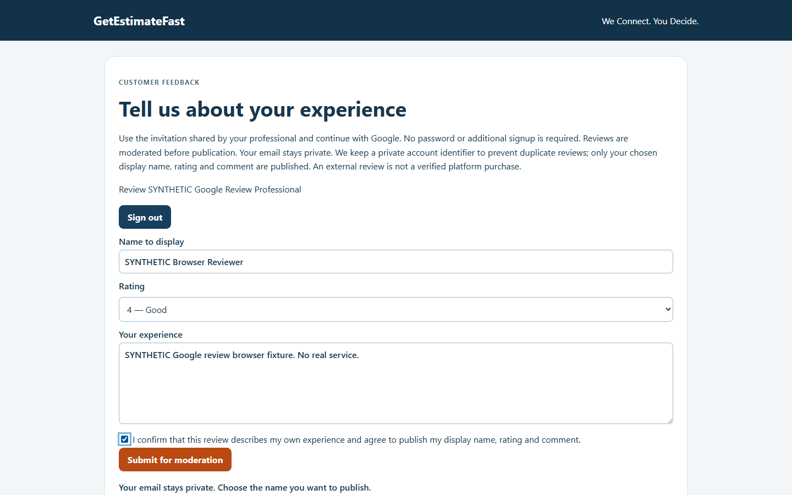
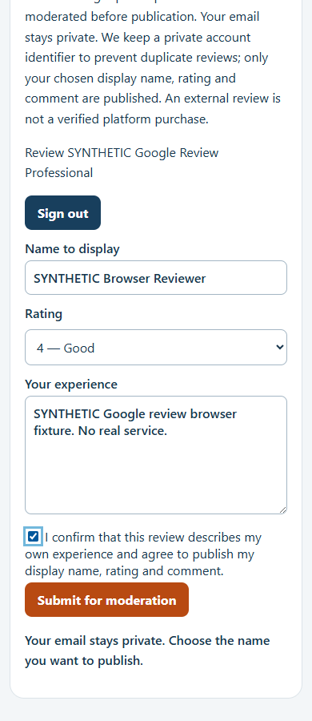

# Google Sign-In para avaliações — entrega e revisão de instalação

Base: PR draft #56. Branch: `feat/google-review-auth-20261010`. Único backend permitido: Development `cpjsbijgijeyrwjpuciv`.

**Código e SQL preparados; nenhuma migration remota ou configuração OAuth executada.** A instalação e a configuração externa dependem de aprovação separada deste relatório e dos quatro arquivos SQL.

## Implementação entregue

- Google OAuth/PKCE via SDK oficial `@supabase/supabase-js`, versão fixada `2.117.3`, com lockfile.
- Runtime da branch fixado em Node 24.x no package.json; SDK exige Node >=22 e os testes usaram Node 24.16.0. Nenhuma configuração do projeto Vercel foi alterada.
- Início, callback, sessão, envio e logout em `api/reviews/`. Backend valida a sessão no Auth; IDs, origem da avaliação e status enviados pelo cliente não autorizam operações.
- Convite existente preservado em contexto criptografado durante o OAuth. Nenhum convite em URL de retorno Google/Supabase. Fragmento removido do endereço visível.
- Cookies criptografados com AES-256-GCM, HttpOnly, Secure no Preview, SameSite=Lax e divisão em chunks; contexto inicial de 10 minutos e sessão de avaliações de até uma hora. A sessão só ganha autoridade após callback Google bem-sucedido e validação no Auth. Tokens do provider e metadados/e-mail do usuário são excluídos da persistência de sessão; tokens Supabase ficam dentro do cookie criptografado.
- Proteção de origem/CSRF, sessão online, rate limit persistente, bloqueio de identidade proprietária no servidor e no SQL, unicidade transacional por usuário Auth e conta Google.
- Cliente sem `contractor_profiles`, senha ou cadastro adicional pode avaliar. Login de avaliações não cria perfil profissional, carteira ou privilégio administrativo.
- Formulário com nome público escolhido pelo usuário, sem pedir e-mail; mensagens de conflito e região live com foco. Rótulo da nota corrigido para associação explícita acessível.
- Moderação, denúncias e auditoria preservadas. Painel distingue identidade Google autenticada de identidade legada excluída da reputação.
- Resumo público de média/quantidade usa todas as avaliações aprovadas autenticadas, sem truncar nas 100 exibidas. Avaliações externas continuam externas; login Google não comprova contratação ou conclusão do serviço.
- Endpoint anônimo antigo passa a recusar envio no código novo. A migration 2 também bloqueia a RPC antiga, fechando o caminho de deployments anteriores.

## Migrações versionadas e ordem exata

Geradas por `supabase migration new`; quatro versões locais distintas, crescentes. Conteúdo UTF-8/LF; `.gitattributes` preserva LF para manter hashes reproduzíveis. Manifesto SHA-256: [google-review-migration-manifest.json](google-review-migration-manifest.json).

| Ordem | Arquivo | Alteração exata |
| --- | --- | --- |
| 1 | `20261010065908_review_authenticated_identity_foundation.sql` | `contractor_reviews.identity_hash` passa a aceitar NULL; adiciona UNIQUE `(id,contractor_id)`; cria tabela privada `review_authenticated_identities`, suas FKs, checks e índices de unicidade |
| 2 | `20261010065922_review_authenticated_submission.sql` | Cria RPCs server-only de contexto e envio autenticado; substitui corpo de `gef_submit_review(jsonb)` por rejeição de envio antigo |
| 3 | `20261010065933_review_authenticated_public_reputation.sql` | Substitui `gef_public_profile(text)` para reputação/lista autenticadas e `gef_admin_marketplace(uuid)` para indicar identidade verificada aos administradores |
| 4 | `20261010065941_review_legacy_classification_audit.sql` | Cria tabela privada de classificação de legado, insere snapshot dos status anteriores e instala trigger que impede UPDATE/DELETE desses snapshots |

Arquivos em `supabase/migrations/`, dependentes da instalação anterior completa dos vinte scripts. Nenhuma alteração em schema gerenciado pelo Supabase Auth.

### Tabelas, FKs, permissões e retenção

`gef_private.review_authenticated_identities`: `review_id` PK; `contractor_id`; `reviewer_user_id`; `provider='google'`; `provider_subject` privado; `created_at`. FK composta do review/owner para `contractor_reviews`, impedindo vincular identidade ao proprietário errado. FK do avaliador para `auth.users` com `ON DELETE SET NULL`. Checks impedem ID do avaliador igual ao proprietário; uniques por profissional/usuário e profissional/provider/subject protegem concorrência e recriação de conta Auth.

`gef_private.review_legacy_classifications`: `review_id` PK/FK, `prior_status`, `classification='legacy_declared_identity'`, `classified_at`; snapshots imutáveis.

Ambas possuem RLS e zero acesso PUBLIC/anon/authenticated. service_role recebe SELECT/INSERT somente na tabela de identidade; somente SELECT na classificação. RPCs usam SECURITY INVOKER, `search_path=''` e EXECUTE exclusivo a service_role. Não há nova exposição de `gef_private`, leitura pública de tabelas ou grant de leitura de Auth aos clientes.

O subject Google é dado pessoal pseudônimo privado, não um e-mail. Manter a reserva de identidade após excluir a conta Auth evita avaliação duplicada por recriação, mas exige política explícita de retenção/exclusão antes de clientes reais. Nenhuma rotina de apagamento foi executada ou inventada nesta etapa.

## Legado e compatibilidade

Preservar reviews antigos, hashes, status e auditorias. Não ligar hashes de e-mail a contas Google por inferência. O resumo e a lista públicos passam a exigir vínculo autenticado privado. Uma aprovação administrativa de review legado, sozinha, não o transforma em avaliação Google nem o inclui na reputação.

Convites antigos não usados e ainda válidos continuam funcionando depois do login. Convites consumidos não são reabertos. Verificação/vinculação de identidade legada não foi implementada silenciosamente; exigirá fluxo próprio revisável.

Estado conhecido na fase anterior: duas avaliações sintéticas, uma rejeitada e outra oculta, zero aprovadas. **Reauditar o Development antes de instalar**; não assumir que esse estado permaneceu igual.

## Testes realizados

- Suíte completa: `node --test --test-concurrency=2 tests/*.test.js`, **75/75 aprovados**, antes do último teste adicional de gates e ajustes finais de apresentação. A concorrência limitada evita sobrecarregar os sandboxes locais simultâneos.
- Reexecução final de Auth/acessibilidade/gates: **4/4 aprovados**. Teste adicional verifica que flags ausentes, schema não aprovado, segredo ausente e Production bloqueiam antes de inicializar SDK/provedor.
- SDK real com transporte OAuth sintético e SQL local: PKCE S256 e code verifier; confirmação online da identidade; convite preservado; cancelamento; logout; cookies adulterados/expirados; cliente sem perfil profissional; CSRF/origem; payload manipulado; autoavaliação; duplicação; privacidade; legado preservado; status e moderação.
- PostgreSQL nativo local: quatro migrations compilam; concorrência real em sessões distintas para mesmo convite e convites distintos; exatamente uma inserção e consumo em cada disputa; tentativa perdedora sem consumir convite; reserva de subject Google sobrevive a novo Auth ID; grants privados e autoavaliação em role service_role.
- Reputação local com 101 approved: lista de 100, contador de 101, média completa `305/101`; pending/hidden e legadas excluídas. Não foram criadas 101 avaliações no Development.
- Chromium local, 1440/390 px, com transporte de UI simulado: convite/retorno, nome acessível da nota, formulário sem e-mail, envio pending, foco da confirmação, logout, zero erros JS e zero overflow horizontal.
- `npm audit --omit=dev`: zero vulnerabilidades reportadas. `git diff --check`: aprovado.

As imagens são de ambiente **local sintético**, não comprovam OAuth Google real ou Preview hospedado. Reproduzir UI com `node scripts/validate-google-review-ui.js`, disponibilizando Playwright por `PLAYWRIGHT_MODULE` e Chromium por `CHROMIUM_PATH`; `REVIEW_EVIDENCE_DIR` é opcional. O teste bloqueia origens externas.

## Riscos a aprovar antes da instalação

1. A alteração da RPC antiga afeta todas as branches que compartilham Development. Deployments antigos deixarão de enviar avaliações; haverá janela de indisponibilidade até o novo código/OAuth estarem prontos. Não reabrir envio anônimo para contornar a janela.
2. Relaxar NOT NULL de `identity_hash` é incompatível com rollback imediato do schema após novas avaliações Google. Não gerar hashes de e-mails fictícios para restaurar a constraint.
3. Novas constraints/DDL podem bloquear tabelas brevemente. Auditar volume/duplicações e executar em janela de testes sem submissões simultâneas. Cada arquivo tem transação; parar no primeiro erro e registrar o histórico.
4. Legadas aprovadas deixam de aparecer/contribuir até verificação de identidade. Essa política já foi aprovada; dados e decisões permanecem preservados.
5. Autoavaliação cobre o Auth ID proprietário, Google vinculado e e-mail Auth confirmado correspondente. Contas diferentes de uma mesma pessoa não podem ser identificadas com certeza só por OAuth; não afirmar prevenção absoluta de múltiplas contas.
6. Callback protegido por SSO, chunks/cookies e limites de cabeçalho precisam de teste real no Preview. Código OAuth aparece transitoriamente na query por exigência do protocolo; aplicação não o registra, mas logs gerenciados devem ser revisados/redigidos antes de alegar ausência em toda a infraestrutura.
7. Conferir configuração global de criação de usuários e hooks Auth. OAuth deve criar somente cliente Auth e não disparar cadastro de profissional, carteira, e-mail/SMS ou outras automações. Alterações de settings/hooks serão apresentadas antes de configuração.

## Instalação futura — exige autorização separada

1. Confirmar projeto `cpjsbijgijeyrwjpuciv`, identidade autenticada e ausência de dados operacionais; consultar histórico dos vinte scripts e verificar objetos, hashes, RLS e funções.
2. Conferir os quatro hashes deste manifesto e versões remotas antes de aplicar. O baseline está em `sql/`; este diretório contém somente as quatro migrations novas. **Não executar `db push`, `db reset`, reaplicar baseline ou reparar histórico automaticamente** sem reconciliar os registros remotos com arquivos locais. Qualquer repair de histórico requer revisão própria.
3. Bloquear submissões durante a transição, instalar em ordem usando mecanismo de migração suportado pelo Supabase e conferir resultado/histórico após cada script. Sem concessões a browser roles e sem SECURITY DEFINER.
4. Rodar Advisors e checar permissões/tabelas/FKs/índices, preservação de legado/auditoria, invocação como service_role e proteção das funções antigas.
5. Configurar Google somente após aprovação externa: client Development, contas Google de teste, callback `https://cpjsbijgijeyrwjpuciv.supabase.co/auth/v1/callback`, origem Preview estável e allowlist de retorno exata. Client ID/Secret ficam no provider Supabase Development, nunca no código/chat/log.
6. Na branch Preview exata, aprovar cadastro seguro de `GETESTIMATEFAST_REVIEW_AUTH_COOKIE_SECRET` e habilitar `GETESTIMATEFAST_REVIEW_SCHEMA_APPROVED=true`/`GETESTIMATEFAST_REVIEW_GOOGLE_ENABLED=true` somente após verificações. Nenhuma dessas variáveis foi configurada agora.
7. Redeploy Preview aprovado e testar Google real com contas dedicadas, SSO, cancelamento, logout, autoavaliação e concorrência sintética. Manter Checkout desativado, SMS dry_run e entregas bloqueadas.

## Rollback proposto

Primeiro rollback **operacional**: desativar o flag Google da branch, suspender submissões e trocar o segredo de cookies somente com autorização/configuração segura se for necessário invalidar todos os contextos. Preservar tabelas, avaliações novas, reservas de identidade, snapshots e auditorias. Não reativar a RPC anônima, publicar legado ou apagar registros automaticamente.

Rollback de schema não será executado como inversão cega dos quatro arquivos: novos registros têm hash nullable e dependências privadas. Antes de qualquer reversão, apresentar migration compensatória, estado dos dados e impacto nas constraints para nova aprovação. A projeção de reputação autenticada e a proibição de envio anônimo devem continuar, mesmo em rollback de interface.

**Pendências reais:** aprovação da instalação/schema, configuração Google e cookies, identidade/URL do Preview configurado, teste hospedado real com SSO e política de retenção. Nenhuma mudança em Production, main, Orçamentos Brasil, Supabase remoto, pagamentos ou envios externos nesta entrega.
