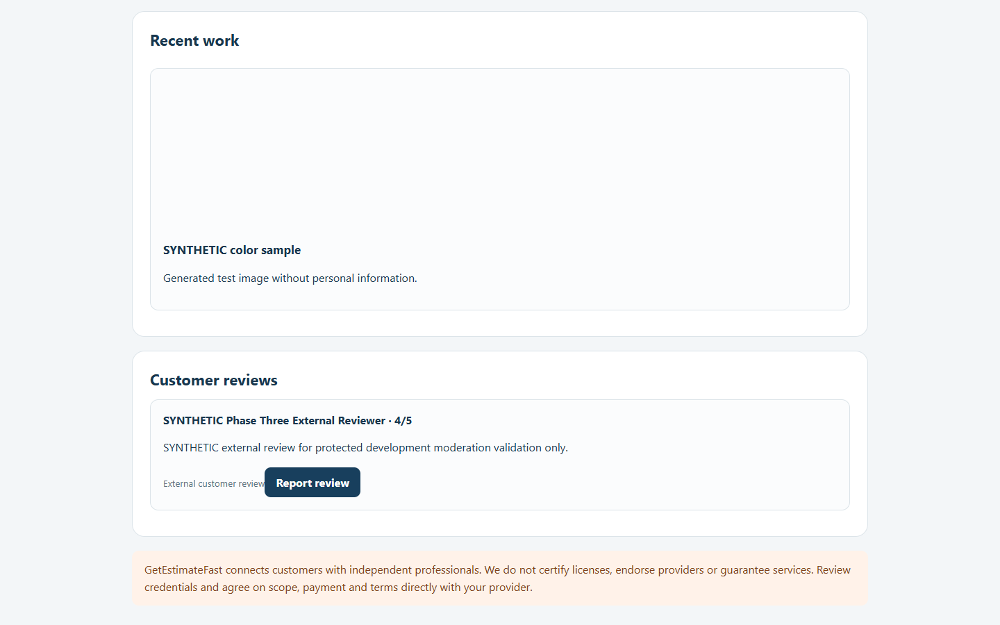
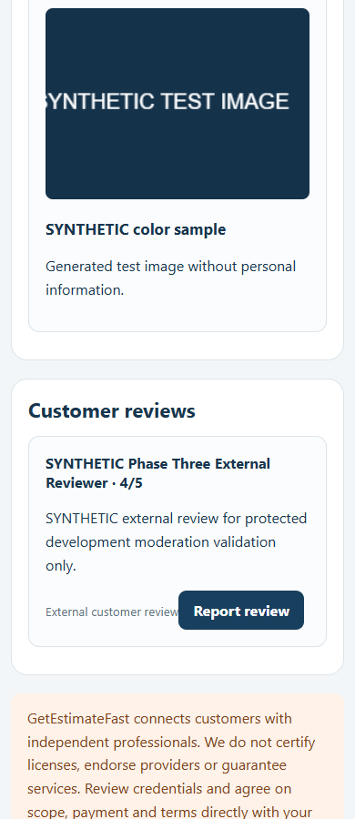
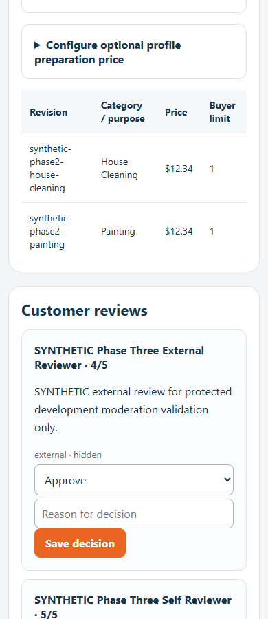
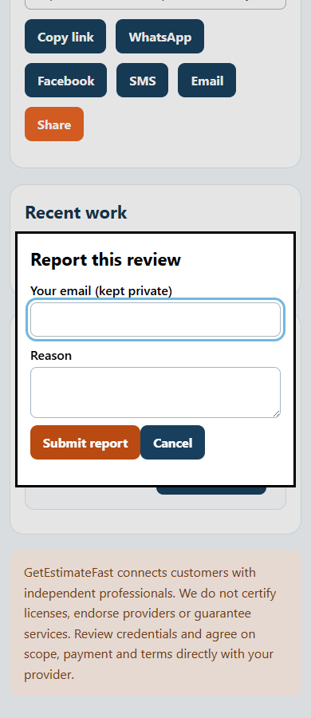

# Fase 3 — avaliações, reputação e moderação

Data: 10/10/2026. Base: PR draft #55. Resultado: **validação parcial; autoavaliação reprovada**.

## Ambiente e evidências

- Supabase exclusivo: `cpjsbijgijeyrwjpuciv`.
- Preview hospedado validado: https://getestimatefast-v2-mji1m6rds-get-estimate-fast.vercel.app
- Deployment: `dpl_8izxogYTnBa1S8ut67fWUkGzA6Ux`, READY, Preview.
- Branch hospedada: `feat/preview-phase2-validation-20261010`.
- SHA hospedado: `e9511c319af6fcf92bfe010b85fc3c9b917553d9`.
- Branch das correções: `feat/preview-reviews-validation-20261010`, baseada na #55.
- Preflight hospedado: HTTP 200, `ready=true`, marketplace de testes habilitado, Checkout desativado.

Acesso automatizado por OIDC temporário do mesmo projeto, com o cabeçalho restrito ao Preview. SSO permaneceu ativo. Requisições externas do navegador foram bloqueadas, exceto imagens sintéticas do Storage Development. Nenhum token, convite, senha ou chave está nas evidências.

As imagens de aprovação registram um estado temporário exclusivamente no Preview protegido. Ao encerrar, nenhuma avaliação permaneceu aprovada.

## Testes hospedados

| Verificação | Resultado e evidência |
| --- | --- |
| Solicitação pelo dashboard profissional | Aprovado; convite criado no navegador, compartilhamento manual, validade de 30 dias; sem envio externo |
| Remoção do convite da URL visível | Aprovado; formulário guarda o token em memória e remove o fragmento do histórico |
| Identificação do avaliador | Parcial; nome e e-mail declarado, HMAC privado; titularidade do e-mail não verificada |
| Autoavaliação | **Reprovado**; o próprio e-mail do profissional foi aceito com HTTP 201, status pending; o administrador rejeitou o teste no navegador |
| Duas submissões simultâneas do mesmo convite | Aprovado para integridade; exatamente uma HTTP 201 e outra HTTP 503; uma única avaliação |
| Mesmo e-mail em um segundo convite | Duplicação bloqueada; HTTP 503 genérico, mensagem inadequada corrigida na nova branch |
| Manipulação de source/status/contractor_id no POST | Aprovado; campos ignorados, proprietário obtido do convite, origem external, status pending |
| Nota fora de 1–5, honeypot e ausência de consentimento | Aprovado; HTTP 400, sem avaliação criada |
| Convite inexistente | Bloqueado com HTTP 503 genérico; nova branch retorna conflito HTTP 409 com orientação |
| Formulário sem convite | Aprovado; formulário oculto e instrução de abrir o convite exclusivo |
| Profissional tentando acesso administrativo | Aprovado; HTTP 403 |
| Leitura direta de avaliações por sessão profissional | Aprovado; HTTP 403; RLS habilitado |
| Aprovação e rejeição administrativas | Aprovado no navegador; decisões persistidas com motivo e auditoria |
| Ocultação após aprovação | Aprovado por API autenticada e conferido no painel; avaliação retirada do perfil |
| Repetição da decisão com a mesma chave | Aprovado; `changed=false`; sem nova decisão de auditoria |
| Mesma chave com decisão diferente | Bloqueado; HTTP 503 genérico; mensagem administrativa ainda pode ser melhorada |
| Denúncia e resolução administrativa | Aprovado no navegador; denúncia recebida e resolvida com auditoria |
| Pendentes, rejeitadas e ocultas no perfil | Não aparecem na projeção pública; apenas a avaliação aprovada mostrou sua nota 4/5 |
| Média de reputação pública | **Ausente**; existem notas individuais, sem média global ou contador de reputação |
| Perfis dos dois profissionais e painel em 1440/390 px | Aprovado, sem overflow horizontal; imagens sintéticas e rótulo External customer review |
| Acessibilidade do diálogo de denúncia | Nome acessível ausente no Preview; corrigido e validado em Chromium local |
| Contraste de botões de avaliação/moderação | 3,31:1 no código anterior; corrigido para 5,22:1 nos controles desse fluxo |

Resultados sanitizados do executor hospedado: [hosted-results.json](evidence/phase3/hosted-results.json).

## Correções propostas nesta PR

1. Conflitos conhecidos de convite e identidade retornam HTTP 409 com mensagem específica. Somente códigos e mensagens SQL explicitamente permitidos são classificados; detalhes de SQL, constraints e dados internos não são enviados ao cliente. Falhas desconhecidas continuam genéricas.
2. Decisões inválidas de moderação retornam HTTP 400 antes de chamar a função SQL.
3. Diálogo de denúncia com nome acessível, status anunciado, foco inicial no e-mail, remoção ao fechar com Escape e retorno do foco ao botão de origem.
4. Contraste melhorado nos botões de envio de avaliação, moderação e denúncia, sem mudar as cores de outros fluxos. Referência: [WCAG 2.2 — Contrast Minimum](https://www.w3.org/WAI/WCAG22/Understanding/contrast-minimum.html).
5. Nova branch incluída na proteção que exige configuração isolada; seu Preview falha fechado se herdar configuração geral inadequada.

Nenhum SQL, schema, grant ou variável remota foi alterado. As lacunas foram registradas em [preview-phase3-review-audit.md](preview-phase3-review-audit.md) antes das respectivas correções.

## Testes das correções

- Suíte completa: `npm test`, **65/65 aprovados** antes dos últimos ajustes pontuais.
- Após a validação de status administrativo e o novo teste de erros: `node --test tests/marketplace-http.test.js tests/review-errors.test.js`, **2/2 aprovados**. Exercita HTTP → autenticação → SQL local, reutilização de convite, identidade duplicada com normalização de e-mail e não divulgação de erros arbitrários.
- Chromium local em 1440/390 px: diálogo nomeado, foco inicial, Escape, Cancel, limpeza do diálogo, foco restaurado, região live e ausência de overflow aprovados.
- `git diff --check`: aprovado.

**As correções desta PR ainda não foram validadas em um novo Preview configurado.** O Preview hospedado citado acima é da #55. Nenhum novo backend/secret de avaliações foi criado para a nova branch; isso evita afirmar deduplicação entre segredos diferentes no mesmo banco.

## Estado final do Development

- Início: zero avaliações, zero convites.
- Final: três convites sintéticos, duas avaliações externas sintéticas: uma rejeitada e uma oculta; **zero aprovadas**.
- Três decisões de avaliação: pending → rejected; pending → approved; approved → hidden. Uma resolução de denúncia. Todas com motivos sintéticos e registro administrativo.
- RLS de avaliações habilitado. `gef_submit_review(jsonb)` não executável por anon ou authenticated.
- Carteira preservada: sete linhas de ledger e uma compra existentes da fase anterior; nenhuma operação financeira nesta fase.
- Advisors de segurança: zero ERROR, um WARN de proteção contra senhas vazadas desativada e 28 INFO de RLS sem políticas em tabelas exclusivamente backend. Nenhuma configuração de Auth alterada.
- Production, main, Orçamentos Brasil e Vercel Production intactos. Sem merge, Stripe Checkout, SMS ou e-mails externos.

## Pendências e autorização necessária

**Não aprovar o fluxo para clientes reais enquanto identidade e autoavaliação estiverem pendentes.** A moderação evita publicação automática, mas não substitui essas proteções.

Proposta para uma etapa de banco separada, sujeita à autorização prévia:

1. Definir se avaliações externas exigirão uma conta Auth confirmada ou outro mecanismo de identidade verificada. E-mail declarado não prova identidade; comparar somente o texto do e-mail não impede usar um endereço alternativo.
2. Para o modelo com Auth: o servidor valida a sessão e fornece o ID confirmado à função de envio. A função rejeita ID igual ao proprietário do convite. Uma identidade de usuário privada e uma constraint por profissional/avaliador impedem duplicação, inclusive se o segredo HMAC mudar. Isso exige mudança de função/schema e tratamento explícito dos registros antigos, sem apagar dados automaticamente.
3. Definir um domínio de identidade estável para as branches que compartilham Development. Não copiar nem revelar Secrets para resolver isso. A unicidade atual depende de um mesmo segredo; não foi certificada entre branches com segredos independentes.
4. Se desejada, acrescentar média e contagem calculadas sobre **todas** as avaliações approved na função de projeção. A lista atual é limitada a 100; uma média calculada apenas dessa lista seria incompleta.
5. Preparar migration revisável, testes de autoavaliação/identidade concorrente e plano de dados legados antes de pedir autorização para aplicação exclusivamente em Development. Não adicionar acesso público às funções privilegiadas.

Depois de definir a identidade, configurar um Preview da nova branch com isolamento e governança do Secret aprovados, repetir os testes hospedados das correções e acrescentar testes com leitor de tela. A validação atual não representa certificação completa de acessibilidade.
